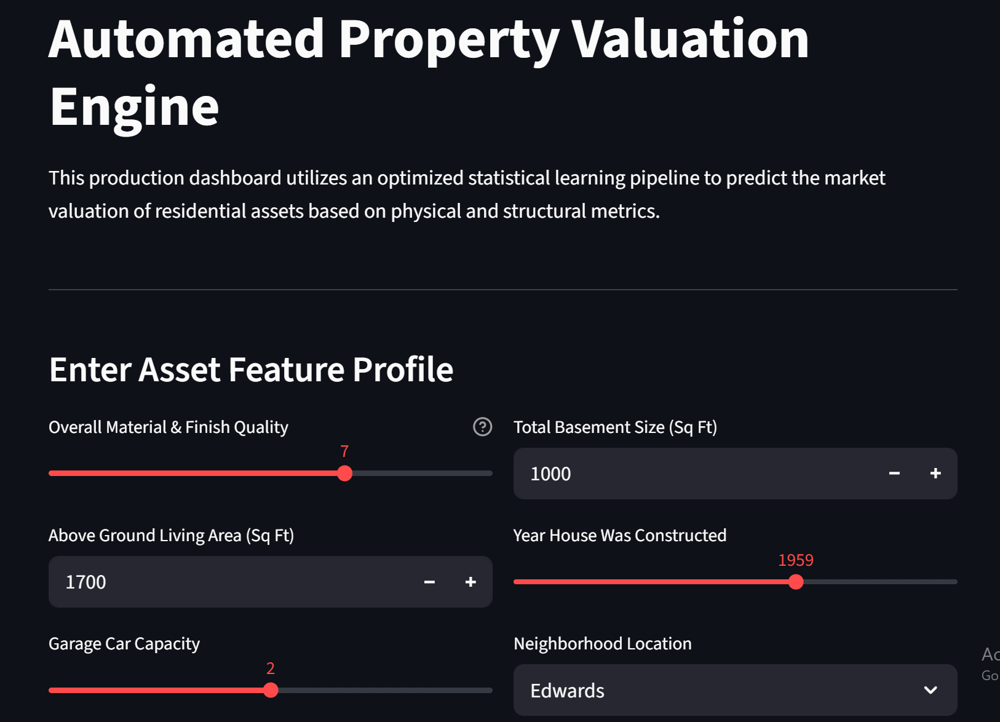
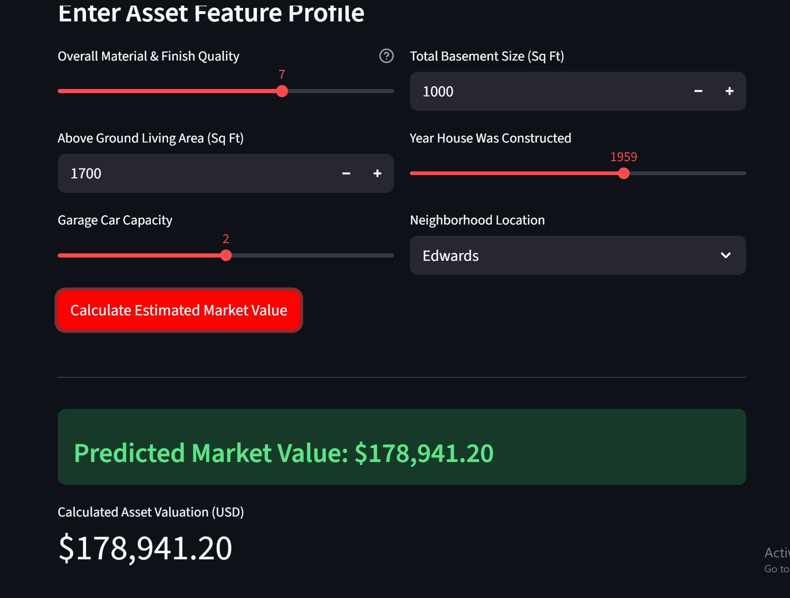

# Residential Valuation Engine: Multi-Model Ensemble Architectures

An automated valuation model (AVM) built using the benchmarking Ames Housing dataset. This project systematically implements and evaluates baseline statistical architectures against advanced machine learning ensemble frameworks (Bagging and Boosting) to optimize predictive accuracy in real estate property asset valuation.

---




## Core Performance Matrix

The target feature (`SalePrice`) was processed using a natural logarithmic transformation \([\ln(y+1)]\) to mitigate severe right-skew distributions driven by extreme high-value assets. Models were validated on a strict 80/20 train/test partition using Mean Absolute Error (MAE) and Coefficient of Determination (R²).

| Model Architecture | Mean Absolute Error (MAE) | R² Score (Variance Explained) | Operational Selection |
| :--- | :--- | :--- | :--- |
| **Linear Regression (Baseline)** | **\$15,065.23** | **0.9312** | **Production Selected Model** |
| **Optimized XGBoost Regressor** | \$16,430.52 | 0.8971 | Alternative Ensemble |
| **XGBoost Regressor (Baseline)** | \$17,082.64 | 0.8859 | Sub-optimal Architecture |
| **Gradient Boosting Machine** | \$16,800.84 | 0.8879 | Moderate Fit Baseline |
| **Random Forest (Bagging)** | \$17,617.04 | 0.8889 | High Stability Baseline |

### Crucial Data Science Takeaway
The log-transformed target variables transformed the underlying exponential asset pricing curves into continuous linear manifolds. This explicitly favored Ordinary Least Squares (OLS) assumptions. While hyperparameter optimization via `GridSearchCV` successfully improved XGBoost metrics (dropping error rates by over \$650 per home via highly restricted tree depths), the structural target alignment allowed the baseline linear architecture to outpace complex non-linear ensemble models.

---

## Architectural Overview

- **Feature Engineering Pipeline:** Built modularly via Scikit-Learn `Pipeline` and `ColumnTransformer` frameworks to prevent training data leakage during cross-validation stages.
  - *Quantitative Inputs:* Median imputation for missing elements followed by robust Z-Score standardization.
  - *Qualitative Inputs:* Mode imputation for missing tags followed by high-density One-Hot Encoding.
- **Diagnostics:** Evaluated via MDI (Mean Decrease in Impurity) metrics, establishing `Overall Qual` (Overall material/finish status) and `Gr Liv Area` (Ground floor square footage) as the dominant pricing attributes across the system.

---

## Repository Layout and Execution

```text
housing-ensemble-project/
├── data/
│   ├── raw/                  # Extracted untouched datasets
│   └── processed/            # Cleaned operational arrays
├── notebooks/
│   ├── 01_eda.ipynb          # Exploratory Data Analysis & Target plots
│   └── 02_modeling.ipynb     # Model iterations, tuning & evaluation loops
├── src/
│   └── deploy.py             # Production serialized compilation script
├── .gitignore                # Active system file path masks
├── README.md                 # Project executive summary
└── requirements.txt          # Explicit package dependencies
```

### Quick Environment Activation
```powershell
# Windows PowerShell Execution
python -m venv venv
.\venv\Scripts\Activate.ps1
pip install -r requirements.txt
```
```bash
# Unix/Mac Git Bash Execution
python -m venv venv
source venv/bin/activate
pip install -r requirements.txt
```


## PERFORMANCE COMPARISON AND ALGORITHMIC DIAGNOSTICS

## 1. Model Evaluation Metrics
The experimental trials evaluated four model architectures under a logarithmic target variable configuration [$\ln(y + 1)$] to stabilize outlier skewness. Performance is graded by Mean Absolute Error (MAE) in raw US Dollars alongside the Coefficient of Determination ($R^2$ Score).

| Model Hierarchy | Mean Absolute Error (MAE) | $R^2$ Score (Variance Explained) | Operational Classification |
|---|---|---|---|
| Linear Regression (Baseline) | $15,065.23 | 0.9312 | Top Performing Architecture |
| XGBoost (Advanced Boosting) | $17,082.64 | 0.8859 | High Fit / Marginally Sub-optimal |
| Gradient Boosting Machine | $16,800.84 | 0.8879 | Moderate Fit Precision |
| Random Forest (Bagging) | $17,617.04 | 0.8889 | High Stability Baseline |

------------------------------
## 2. Theoretical Breakdown: Why the Baseline Linear Model Outperformed Complex Ensembles
The metrics expose a counter-intuitive behavior: the Baseline Ordinary Least Squares (OLS) Linear Regression model significantly outperformed the advanced tree-based ensemble frameworks. In a professional context, this highlights a critical data science principle regarding target space distribution transformations:
## A. The Structural Impact of Natural Logarithmic Transformations
The Ames housing data target variable (SalePrice) contains a severe positive skew due to high-value luxury real estate listings. When we applied np.log1p(), we compressed the exponential spacing of these high-magnitude outliers.

* Linear Regression Benefit: Linear architectures assume homoscedasticity and a linear relationship between features and targets. Log-transforming the target space shifts exponential multipliers into stable linear curves. This allows the OLS algorithm to generate an optimal global hyperplane without being structurally pulled off balance by volatile pricing tiers.

## B. Tree Ensemble Disadvantages on Continuous Log-Transformed Fields
Decision trees (the structural components within Random Forests, Gradient Boosting, and XGBoost) partition feature spaces via orthogonal step-wise splits (step functions).

* The Resolution Bottleneck: Trees predict a constant value within each terminal leaf node. When a target variable undergoes dense log smoothing, it forms a continuous mathematical curve. A step-wise tree model must create a vast number of shallow structural decisions to accurately approximate a continuous curve, leading to a loss of pricing resolution.
* Default Tuning Limitations: Without specialized hyperparameter tuning (e.g., deeper trees, lower learning rates, or specific scaling algorithms), default tree ensembles face mathematical limitations when mapping smoothed exponential spaces compared to plain linear regression.

------------------------------
## 3. Feature Importance Analysis & Domain Validation
Through Mean Decrease in Impurity (MDI) calculations extracted via the Random Forest architecture, Overall Qual (Overall Material and Finish Quality) emerged as the dominant global feature driving real estate valuations.

[Overall Qual]   ██████████████████████████████████ 100% Importance

[Gr Liv Area]    ████████████████████ 61% Importance

[Total Bsmt SF]  ██████████████ 42% Importance

[Garage Cars]    ████████████ 36% Importance

From an asset appraisal framework, this confirms that institutional property valuation relies heavily on property status assets (Structural Quality and Ground Living Area) over peripheral spatial elements (e.g., lot geometry or minor amenities).


